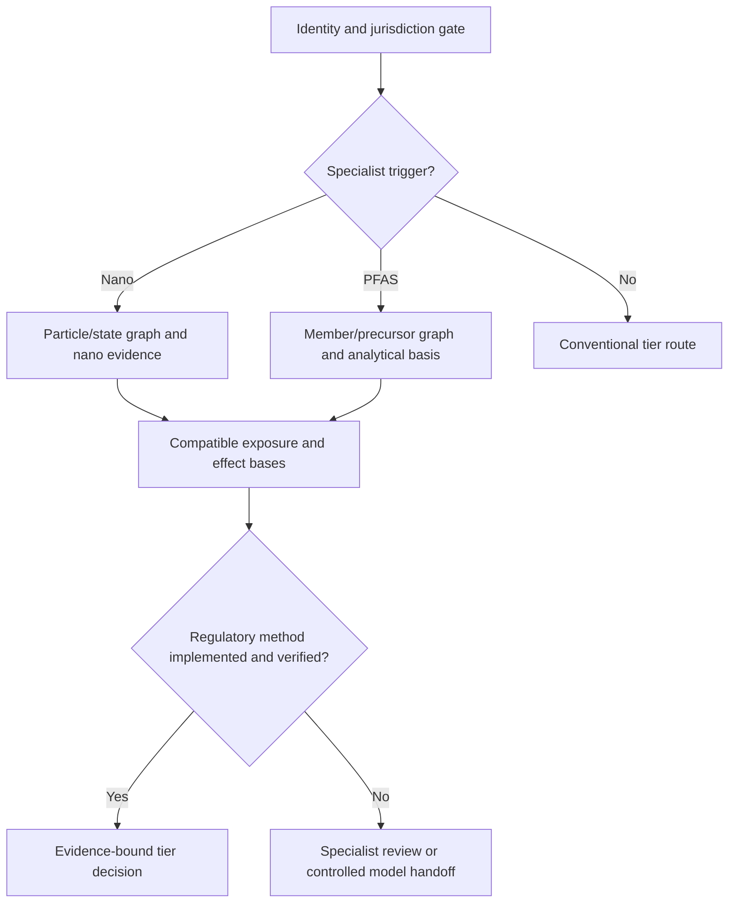

# Regulatory environmental fate and ecotoxicology requirements for nanoforms, nanomaterials and PFAS

**FateIntel software specification and jurisdictional comparison**  
**Evidence cut-off:** 9 September 2026  
**Implementation status:** specification only; no executable nano/PFAS regulatory rules are claimed

## Executive conclusion

Nanoforms/nanomaterials and PFAS belong in FateIntel, but neither should be added as a cosmetic contaminant-group option that reuses the ordinary neutral-organic workflow. They each require a specialist identity model, additional environmental state variables, adapted evidence-quality rules and fail-closed orchestration.

For a conventional dissolved organic chemical, a screening assessment may reasonably begin with molecular properties, equilibrium partition coefficients, degradation half-lives and a PEC/PNEC ratio. That pattern fails in two different ways here:

- A nanomaterial may exist as primary particles, agglomerates, aggregates, environmentally transformed particles and dissolved species. Its transport and effects depend on particle size/shape, surface treatment, dispersion history, water chemistry, aggregation, settling and dissolution. A single `Kow`, `Koc` or dissolved-mass concentration does not describe that system.
- PFAS is a large structural universe, not one substance and not one uniform regulatory category. Many terminal perfluoroalkyl acids are extremely persistent and mobile; precursors can transform into them; neutral precursors and ionic terminal products behave differently; sorption includes mineral, organic-carbon and air-water interfacial processes; and tissue accumulation may follow protein binding rather than neutral-organic lipid partitioning.

The appropriate FateIntel architecture is therefore:

1. identify the legally relevant material/entity and applicable jurisdictional definition;
2. represent all fate-relevant forms and associated chemicals in an identity/state graph;
3. retain mass, particle-number, surface-area, dissolved/particulate and analytical bases without silent conversion;
4. route to the jurisdiction-specific regulatory pathway;
5. accept only scientifically compatible PEC and effect evidence;
6. use controlled, provenance-preserving handoffs for site-specific or authority-owned models; and
7. keep classification, restriction, emission-minimisation and risk-quotient decisions as distinct regulatory objects.

This specification does **not** mean FateIntel now performs a complete nano/PFAS assessment. The executable build exposes the requirements registry with a `specification_only` status and blocks any claim that the listed rules are live.

## 1. Scope and status language

### 1.1 Scope

This review prioritises the European Union/EEA, Great Britain, United States, Canada, Australia and OECD cross-border methods, and includes the Stockholm Convention where it creates a distinct global PFAS obligation. It focuses on environmental fate, environmental exposure, ecotoxicology and environmental risk characterisation.

“All guidance” cannot responsibly mean every national notice, state/provincial limit, product-specific decision or future revision. The corpus here is the controlling or method-defining set needed to design the software: binding legal texts, competent-authority frameworks, OECD test/guidance documents, national environmental-management guidance and official method/status pages. Every assessment still needs a current-source check for the exact substance, use, location and submission date.

### 1.2 Status legend

| Status | Meaning in FateIntel |
| --- | --- |
| Binding law/rule | A legal text, but applicability still depends on jurisdiction, scope and effective date. |
| Regulatory/competent-authority guidance | An official interpretation or method; it is not automatically binding in every decision. |
| Recommended criterion | A regulator's recommended benchmark; legal effect may require adoption in a permit, standard or state/territorial rule. |
| Interim/nonbinding guidance | Useful for current assessment but must never be displayed as a final legal obligation. |
| OECD method/guidance | Supports study design, interpretation and international data acceptance; it is not itself a market authorisation. |
| Research-only | May explore mechanisms or refinements but cannot claim regulatory alignment without authority acceptance. |
| Specification only | Designed and source-backed, but not yet executable or validated in FateIntel. |

## 2. Nanoforms and nanomaterials

### 2.1 Regulatory identity comes before fate modelling

“Nanomaterial” is a scientific umbrella term; “nanoform” is also a specific REACH information unit. FateIntel must not infer either status from a trade name, a single average size or an existing bulk-substance record.

The EU amended REACH annexes through Commission Regulation (EU) 2018/1881 so nanoforms are addressed explicitly in registration and chemical safety assessment. Covered forms must be reported individually or as a scientifically justified set of similar nanoforms, and the dossier must identify the nanoform/set to which evidence and conclusions apply.[S1] ECHA's nanoform grouping/read-across appendix makes the justification endpoint-specific: evidence that forms are similar for one endpoint does not establish similarity for all endpoints.[S2]

US EPA's TSCA nanoscale rule is a reporting and recordkeeping rule for discrete nanoscale forms, not a declaration that all such materials are harmful or safe. New chemical nanoscale materials may also require premanufacture review, while consent orders or significant-new-use rules can impose case-specific testing, exposure and release controls.[S9–S10]

Canada's 2026 CEPA framework adapts ordinary risk-assessment logic to manufactured nanomaterials, explicitly recognising that particle form, media properties and transformations influence exposure and hazard.[S11] Australia applies its own AICIS nanoscale categorisation criteria and specified-class/risk rules; EU or US status cannot be copied into the Australian route without rechecking those criteria.[S12]

#### Minimum nanoform identity record

| Domain | Required record | Why it affects fate/effects |
| --- | --- | --- |
| Composition | Core chemistry, impurities, dopants, additives and stabilisers | Dissolution, toxicity and transformations may reflect constituents rather than an idealised core. |
| Particle size | Number-based distribution, range and method | Governs transport, surface area, settling and cellular interaction; mass-average size is not an equivalent substitute. |
| Shape | Morphology and aspect ratio | Fibres, plates and irregular particles can behave differently from spheres. |
| Surface | Functionalisation/coating, coverage, charge/zeta potential | Controls colloidal stability, attachment and biological interactions. |
| Structure | Crystallinity/polymorph and specific surface area | Influences dissolution, reactivity and dose. |
| Preparation | Stock preparation, dispersion agent and delivered sonication energy | The test exposure can be created or changed by preparation. |
| Batch | Tested batch, purity and characterisation snapshot | Evidence must be traceable to the actual material tested. |
| Dynamic state | Agglomeration, aggregation, dissolution and transformed products | The released entity may not be the entity reaching the receptor. |

### 2.2 How nanomaterial environmental fate is assessed

Nanomaterial fate is a dynamic material-state and mass-flow problem. The following stages are needed.

#### Stage A — Release form and receiving medium

Define whether release is as a dry powder, liquid dispersion, embedded particle, matrix fragment, dissolved species or weathered product. Record use/release rate and the receiving medium. A particle embedded in a polymer, a coated particle released to wastewater and an uncoated powder released to air are different starting states.

#### Stage B — Dispersion stability, agglomeration and settling

OECD TG 318 measures time-dependent dispersion stability in simulated environmental media under controlled hydrochemistry.[S4] A valid record includes dispersion preparation, sonication/calibration, mass concentration versus time, pH, ionic strength and relevant organic matter. The result informs whether waterborne exposure is plausible, whether sedimentation dominates and how later tests should be designed.

The assessment must distinguish:

- **homoagglomeration:** particle-particle association;
- **heteroaggregation/attachment:** association with natural colloids, suspended solids, mineral surfaces or biota;
- **settling/deposition:** transfer from water column to bed/sediment;
- **resuspension:** renewed water-column exposure; and
- **filtration/retention:** removal or delay in soil and porous media.

These are kinetic colloidal processes. A conventional equilibrium `Koc` model may be inappropriate unless its applicability to the material and question is demonstrated.[S11]

#### Stage C — Dissolution and speciation

Apparent solubility and dissolution rate must be separate fields. OECD TG 322 provides a standardised environmental-fate approach, including short apparent-solubility and time-resolved dissolution components under specified pH/temperature conditions.[S6] The companion OECD guidance explains how dissolution and dispersion-stability information should shape further testing.[S5]

FateIntel must keep at least three ledgers:

1. total material mass;
2. particulate material mass; and
3. dissolved species mass and identity.

If dissolved ions drive toxicity, their fate and effect evidence may be assessed separately—but the particle PEC cannot simply be divided by an ion PNEC.

#### Stage D — Environmental transformation

Track redox transformations, sulfidation, oxidation, photochemical changes, coating loss, surface ageing and corona formation as related material states. A transformed particle is not necessarily a new legal substance, but it is a distinct exposure state. The graph must link it to the source nanoform and retain mass/provenance.

#### Stage E — Compartment mass flow

For wastewater, treatment “removal” may mean attachment to sludge rather than destruction. FateIntel must show effluent passage, sludge/biosolids transfer, dissolution/transformation, off-gas (if relevant) and unresolved mass separately. Soil/sediment accumulation, burial and resuspension remain dynamic compartments.

For groundwater, a specialist transport model must represent colloidal attachment/detachment, size exclusion/filtration, dissolution and matrix chemistry if those processes matter. A conventional dissolved-solute screen can be retained only as a separately labelled comparator with a documented applicability decision.

#### Stage F — Bioaccumulation

OECD's integrated guidance on apparent accumulation explains why equilibrium octanol-water partitioning is not an appropriate general predictor for particles and structures evidence from dissolution/stability through higher-tier testing. The likely exposure route matters: waterborne assessment may be suitable for stable dispersions, whereas dietary testing may be more relevant for unstable or sediment-associated material.[S8] FateIntel should treat this as a tiered weight-of-evidence decision, not compute a nano BCF from `log Kow`.

### 2.3 How nanomaterial ecotoxicology is assessed

OECD GD 420 provides second-edition guidance for aquatic and sediment tests and adaptations to core OECD test guidelines.[S7] The assessment must record whether exposure remained characterised and whether physical artefacts influenced the endpoint.

Required validity/interpretation checks include:

- measured concentration and material state through the test, with time-weighted concentration where justified;
- medium pH, ionic strength, organic matter and preparation/sonication;
- settling and unequal exposure among organisms;
- feeding inhibition, gut loading, fouling or shading that may produce physical rather than chemical effects;
- adsorption to test vessels or analytical recovery problems;
- optical/colorimetric assay interference;
- contribution of dissolved constituents; and
- correspondence between tested batch and registered/assessed nanoform.

The PNEC workflow therefore needs a **nano evidence-acceptability gate** before endpoint selection. Even a numerical LC50/EC10/NOEC is not decision-eligible until test item, exposure and measurement basis are compatible with the PEC.

### 2.4 Nanoform PEC/PNEC compatibility

An automatic connection is allowed only when all applicable dimensions agree:

- nanoform or justified set;
- as-manufactured versus environmentally transformed state;
- total, particulate or dissolved fraction;
- mass, number or surface-area basis;
- medium/compartment and phase;
- temporal and spatial scale;
- test preparation and relevant hydrochemistry; and
- endpoint validity and analytical method.

Mass, number and surface-area concentrations cannot be converted from one another without measured particle distributions/density/geometry and a declared model. FateIntel must never silently manufacture that conversion.

### 2.5 Nanoform routes by jurisdiction

| Jurisdiction | Primary route | Fate/ecotox treatment | FateIntel status |
| --- | --- | --- | --- |
| EU/EEA | REACH nanoform-specific annex requirements and ECHA guidance | Nanoform/set identity, endpoint-specific read-across, nano-adapted fate/effect evidence and chemical safety assessment | Specification; dossier decision requires expert review [S1–S2] |
| Great Britain | UK REACH plus current HSE recommendations | Current nano guidance, robust study summaries, tested-batch detail and measured aquatic exposure where instability matters | Specification; current-source check required [S3] |
| United States | TSCA section 8(a) nanoscale reporting and new-chemical review | Manufacture/use/exposure/release information, case-specific fate/hazard evidence and potential consent-order/SNUR controls | Controlled regulatory handoff [S9–S10] |
| Canada | CEPA manufactured-nanomaterial framework | Adapted exposure and hazard assessment, multiple quantity metrics, aggregation/dissolution/transformation and weight of evidence | Strongest public architecture reference; not yet executable [S11] |
| Australia | AICIS categorisation/assessment | Apply Australian nanoscale trigger and introduction risk category before endpoint work | Applicability gate specified [S12] |
| OECD | TGs, guidance, GLP/MAD | Dispersion, dissolution, aquatic/sediment testing, bioaccumulation and grouping support | Method registry; receiving-authority acceptance still required [S4–S8] |

## 3. PFAS and associated chemicals

### 3.1 PFAS is an entity network, not a checkbox

OECD's 2021 terminology provides a broad structural definition and a practical classification framework.[S13] It is invaluable for chemical identification, but it is not automatically the legal scope of every restriction, inventory or assessment. FateIntel must store the definition, version, jurisdiction/programme and any exclusions used for each decision.

The identity graph should distinguish:

- individual PFAS member;
- acid and salt/counterion forms;
- linear and branched isomers;
- neutral and ionic forms;
- precursors and intermediates;
- terminal perfluoroalkyl acids;
- ultrashort-chain/highly mobile products, including TFA where structurally relevant;
- side-chain fluorinated polymers;
- fluoropolymers;
- commercial mixtures/formulations; and
- analytical aggregates such as a named-analyte sum, TOP response or extractable/total organic fluorine.

This matters because a precursor may be relatively volatile and then form a persistent ionic terminal product; a polymer may release non-polymeric PFAS; and “total PFAS” can refer to very different analytical constructs.

### 3.2 How PFAS environmental fate is assessed

#### Stage A — Source and life-cycle inventory

Quantify relevant manufacture, formulation and use releases; firefighting foam sources; wastewater and biosolids; landfill/leachate; recycling; incineration or other treatment; atmospheric emissions; and historical sources. Keep transfer separate from destruction. Canada and Australia's public assessments show why releases through wastewater, biosolids and waste management must be retained across compartments.[S20–S21]

#### Stage B — Analytical strategy and mass-balance boundary

The measurement design is part of the fate model. Targeted methods identify only their analyte list. EPA Method 1633, for example, is a targeted method for 40 PFAS across several environmental matrices; it does not establish absence of unmeasured PFAS.[S17]

FateIntel needs distinct evidence types for:

- targeted analyte concentration;
- defined sum of named PFAS;
- total oxidisable precursor (TOP) assay response;
- extractable organic fluorine (EOF);
- total organic fluorine (TOF); and
- suspect/non-target identification.

TOP is semi-quantitative and does not reproduce every environmental transformation product or rate. EOF/TOF is a fluorine mass measure, not an automatic concentration of a particular PFAS. These results must not be imported into the same numeric endpoint field.

#### Stage C — Conceptual site model

For contaminated land and groundwater, Australia's PFAS NEMP 3.1 requires a robust conceptual site model built around sources, pathways and receptors, with relevant geology, hydrogeology and temporal/seasonal variability.[S21] This should drive sampling and model selection rather than the software selecting a generic groundwater calculator first.

#### Stage D — Multiphase transport

Assess:

- aqueous advection and hydrodynamic dispersion;
- sorption to organic carbon and mineral surfaces;
- electrostatic interactions and pH-dependent speciation;
- retention at air-water and NAPL-water interfaces;
- vadose-zone leaching and episodic flushing;
- groundwater-surface-water exchange;
- colloidal/particulate transport where relevant;
- atmospheric transport/deposition for volatile precursors; and
- plant and biota uptake.

ITRC's technical guidance explains that PFAS transport depends on both chemical features (chain length, functional group, ionic state, fluorination) and site conditions, and cannot generally be reduced to one generic `Koc` correlation.[S23] NEMP 3.1 also highlights interfacial retention and the limitations of simplified leaching tests.[S21]

Therefore PWC, PRZM or a generic leaching screen must not be labelled a complete PFAS transport method without validation for the substance, processes, scenario and decision context. A site-specific numerical model is best handled through FateIntel's controlled handoff: input snapshot, model/version, raw output, hashes, endpoint mapping, calibration/sensitivity record and independent review.

#### Stage E — Precursor transformation network

PFAS fate is often persistence **plus transformation**, not ordinary disappearance. The model must represent stoichiometric/uncertain precursor-to-intermediate-to-terminal-product edges and distinguish transformation from mineralisation. Absence of a terminal PFAA at one time point does not show that persistent products will not form later.

#### Stage F — Wastewater and waste management

Treatment removal must be allocated among effluent, sludge/biosolids, air, leachate, residues, transformation products and verified destruction. EPA's 2026 destruction/disposal guidance is interim and nonbinding and retains technology-specific uncertainty.[S19] A percentage “removed” from water must not be called destroyed.

#### Stage G — Bioaccumulation and food-web transfer

For many PFAS, lipid-normalised `log Kow`/BCF expectations for neutral organics do not capture protein binding, tissue distribution or dietary biomagnification. Canada explicitly notes that conventional numeric freshwater bioaccumulation criteria may not capture dietary biomagnification in air-breathing organisms.[S20] NEMP 3.1 recommends multiple lines of evidence and cautions against predicting biota accumulation from water concentration alone.[S21]

### 3.3 PFAS ecotoxicology and risk characterisation

FateIntel must support matrix- and basis-specific benchmarks:

- water-column acute and chronic criteria;
- sediment, soil or porewater benchmarks where authorised;
- whole-body and tissue-specific values;
- dietary/food-web endpoints;
- individual substances;
- defined sums or mixture/hazard-index approaches; and
- class-based hazard/risk-management conclusions.

EPA's 2024 PFOA and PFOS aquatic-life products illustrate why basis is critical: they include distinct freshwater water-column and tissue values, and the water criteria have specific averaging/frequency conventions.[S18a–S18b] A tissue value is not a PNEC in `µg/L`, and an instantaneous tissue criterion cannot be passed through an aqueous dilution model.

A risk quotient remains useful when a compatible PEC and benchmark exist. It is not a universal PFAS decision engine. Class restrictions, CLP hazard classification, Stockholm Convention listing, non-threshold emission minimisation and contaminated-site management can require conclusions that are not reducible to `PEC/PNEC`.

### 3.4 PMT/vPvM

PMT/vPvM is relevant to some PFAS but is not synonymous with PFAS. The harmonised EU criteria were introduced into CLP by Commission Delegated Regulation (EU) 2023/707—not “created by REACH.”[S14]

At a high level, the EU criteria combine:

- **P/vP:** media-specific degradation half-lives;
- **M/vM:** low organic-carbon partition coefficient (`log Koc`), using the lowest value over pH 4–9 for ionisable substances; and
- **T:** long-term aquatic effect thresholds or specified serious health/endocrine classifications.

Exact threshold logic and the full weight-of-evidence provisions are retained in the machine-readable specification, but the runtime rule is deliberately disabled. A credible implementation needs evidence sufficiency, ionisation-aware Koc, study reliability, conflicting-data handling and reviewer judgment—not three unqualified text boxes.

Great Britain's published approach is explicitly interim and supports UK REACH risk-management prioritisation; it is not itself a harmonised GB legal classification.[S16]

### 3.5 PFAS routes by jurisdiction

| Jurisdiction | Primary route | Fate/ecotox treatment | FateIntel status |
| --- | --- | --- | --- |
| EU/EEA | REACH/CLP and media-specific law; broad PFAS restriction process | Substance/group scope, PMT/vPvM where applicable, exposure/effect evidence, restriction alternatives/emissions | Change-watch required: the broad dossier remains a proposal until legal completion [S14–S15] |
| Great Britain | UK REACH/GB CLP plus interim PMT approach | Prioritisation and risk management with current legal checks | Interim-policy label mandatory [S16] |
| United States | Statute/programme-specific TSCA, CWA/SDWA, CERCLA/RCRA, FIFRA or site route | New-chemical framework, method-specific analytics, water/tissue criteria, site assessment, disposal guidance | Multiple controlled routes; no invented single “EPA PFAS model” [S17–S19] |
| Canada | CEPA class assessment and instrument-specific follow-on | Class weight of evidence (with defined exclusions), precursors/terminal products, transport, ecological and human exposure | Class conclusion must not be turned into member-specific numeric RQ [S20] |
| Australia | NEMP 3.1 plus AICIS introduction categorisation | Conceptual site model, multi-matrix evidence, waste/reuse/landfill/biosolids, ecotoxicology and introduction gate | Detailed environmental workflow; current jurisdiction values required [S21–S22] |
| Global | Stockholm Convention and national implementation | Listed chemical/related-compound scope, exemptions and national controls | Applicability/change watch [S24] |

## 4. Cross-model compatibility rules

The Alpha 4 orchestration engine already checks compartment, phase, unit dimension, concentration basis, temporal statistic, averaging period, spatial scale and substance basis. Nano/PFAS require these added dimensions.

| Dimension | Nano requirement | PFAS requirement | Fail-closed example |
| --- | --- | --- | --- |
| Entity | Nanoform/set and transformed state | Member, isomer/salt, precursor/terminal product, defined group | Bulk TiO2 PNEC vs coated nano-TiO2 PEC |
| Fraction | Total/particulate/dissolved | Dissolved/colloid/particle/interface | Total particle PEC vs dissolved-ion EC10 |
| Quantity basis | Mass/number/surface area | Target analyte/sum/TOP/EOF/TOF | TOP response entered as ng/L PFOA |
| Medium | Hydrochemistry and dispersion protocol | pH/salinity/organic carbon/mineral/interface context | Freshwater Kd applied to saline vadose zone |
| Time | Stability/dissolution during test | Acute/chronic/tissue and precursor transformation | 1 h acute value treated as annual chronic value |
| Model applicability | Colloid/particle processes represented | Interfacial sorption and precursor network represented | Ordinary equilibrium Koc leaching result claimed as complete PFAS assessment |

## 5. Proposed FateIntel workflow

### 5.1 Required record objects

1. **Applicability decision** — jurisdiction, definition/version, trigger evidence, exclusions, reviewer.
2. **Assessment entity graph** — source form/member, associated chemicals, transformations and confidence.
3. **Evidence object** — exact entity/batch, method/version, matrix, basis, QA/GLP and source snapshot.
4. **State/mass ledger** — release, phase/fraction transfers, transformations, destruction and unresolved mass.
5. **Model applicability record** — represented processes, omissions, calibration, domain and regulatory status.
6. **Compatibility decision** — every scientific basis dimension plus explicit conversions/models.
7. **Risk or other regulatory decision** — RQ where appropriate; separate classification/restriction/emission-management objects elsewhere.
8. **Immutable assessment record** — exact source versions, inputs, hashes, reviewer and jurisdictional conclusion.

### 5.2 Five implementation phases

| Phase | Build | Acceptance boundary |
| --- | --- | --- |
| 1. Identity/applicability | Nano jurisdiction gate; PFAS definition/structure gate; entity graph | A specialist material cannot silently enter conventional-organic defaults. |
| 2. Evidence basis | Nano characterisation schema; PFAS analytical-basis schema; study-validity review | Every value identifies the tested/measured entity, method and basis. |
| 3. Fate ledgers | Particle/dissolved ledger; precursor/product ledger; interfaces and waste transfer | Transfer, transformation and destruction are distinguishable; mass is auditable. |
| 4. Ecotox/risk | Nano test validity; multi-basis compatibility; PFAS water/tissue and mixture logic | Only scientifically compatible evidence can control a tier. |
| 5. Jurisdictions/models | EU/UK/US/CA/AU routes; OECD versions; model handoffs; change watch | Regulatory-aligned and research-only assessments are distinguished automatically. |

### 5.3 Minimum adversarial acceptance tests

- A bulk-form endpoint cannot satisfy a nanoform endpoint without a reviewed relationship.
- A dissolved-ion endpoint cannot be combined with total-particle exposure.
- Mass cannot be converted to particle number without particle measurements and an explicit model.
- An OECD PFAS structure match cannot automatically create legal PFAS scope in every jurisdiction.
- TOP/EOF/TOF cannot masquerade as a targeted analyte concentration.
- A precursor PEC cannot be divided by a terminal-product PNEC without a reviewed transformation model.
- A conventional `Koc`-only groundwater screen cannot claim regulatory alignment for PFAS or colloidal nanomaterials.
- PMT/vPvM cannot conclude with incomplete P, M or T evidence.
- A tissue criterion cannot be treated as a water-column PNEC.
- External site models must retain input snapshots, exact model/version, raw-output hashes, endpoint mapping and independent review.

## 6. What should be built now—and what should wait

### Build next

1. Add the specialist trigger and application-status panel to Tier Orchestration.
2. Extend the chemical identity model for nanoform/set/batch and PFAS entity relationships.
3. Extend `ScientificQuantity` with entity, analytical-method and material-state basis identifiers.
4. Add the nano study-validity and PFAS analytical-basis review forms.
5. Add change-watch items for OECD nano methods, EU PFAS restriction status, GB PMT policy, US PFAS criteria/rules, and Australian NEMP updates.
6. Add controlled external-model records for nano/PFAS site transport, without claiming that FateIntel itself solves site hydrogeology.

### Wait for method validation or a design partner

- native site-specific 2-D/3-D PFAS groundwater simulation;
- automated nanomaterial grouping/read-across;
- automatic class-wide PFAS PNECs;
- universal nanomaterial exposure factors;
- legal determination of every PFAS restriction exemption; and
- redistribution of proprietary databases or authority-owned executable models.

## 7. Limitations and change control

- Regulatory sources are living. The assessment record must store source version/date and a snapshot hash, and reopen the applicability decision after a material update.
- EU, GB, US, Canadian and Australian definitions and decision pathways are not interchangeable.
- State, provincial, territorial, permit and contaminated-site values can be more specific than the national sources summarised here.
- The report does not establish the legal or hazard status of a named chemical, nanoform, product or site.
- Research models can inform a weight of evidence but become regulatory-aligned only through an explicitly accepted use.
- The software must communicate “insufficient evidence” and “method not implemented” as valid outcomes; it must not manufacture certainty from default values.

## Sources

**[S1]** European Commission. *Commission Regulation (EU) 2018/1881 amending REACH annexes to address nanoforms* (2018; applicable 1 January 2020). <https://eur-lex.europa.eu/eli/reg/2018/1881/oj/eng>

**[S2]** European Chemicals Agency. *Appendix R.6-1 for nanoforms applicable to Guidance Chapter R.6: QSARs and grouping of chemicals* (December 2019). <https://echa.europa.eu/documents/10162/2324906/appendix_r6_nanomaterials_en.pdf/71ad76f0-ab4c-fb04-acba-074cf045eaaa>

**[S3]** UK Health and Safety Executive. *Article 54 reports and recommendations: nanomaterials recommendations* (current-source check 9 September 2026). <https://www.hse.gov.uk/reach/reports/recommendations.htm>

**[S4]** OECD. *Test No. 318: Dispersion Stability of Nanomaterials in Simulated Environmental Media* (2017). <https://www.oecd.org/en/publications/2017/10/test-no-318-dispersion-stability-of-nanomaterials-in-simulated-environmental-media_g1g837a1.html>

**[S5]** OECD. *Guidance Document for the Testing of Dissolution and Dispersion Stability of Nanomaterials and the Use of the Data for Further Environmental Testing and Assessment* (2020). <https://www.oecd.org/en/publications/guidance-document-for-the-testing-of-dissolution-and-dispersion-stability-of-nanomaterials-and-the-use-of-the-data-for-further-environmental-testing-and-assessment_f0539ec5-en.html>

**[S6]** OECD. *Test No. 322: Determination of the Solubility and Dissolution Rate of Nanomaterials for Environmental Fate Assessment* (2026). <https://www.oecd.org/en/publications/2026/07/test-no-322-determination-of-the-solubility-and-dissolution-rate-of-nanomaterials-for-environmental-fate-assessment_9a487069.html>

**[S7]** OECD. *Guidance Document on Aquatic and Sediment Toxicological Testing of Nanomaterials, Second Edition* (2025). <https://www.oecd.org/en/publications/guidance-document-on-aquatic-and-sediment-toxicological-testing-of-nanomaterials-second-edition_17b3ce6f-en.html>

**[S8]** OECD. *Guidance Document on an Integrated Approach on Testing and Assessment for the Apparent Accumulation Potential of Nanomaterials* (2025). <https://one.oecd.org/document/ENV/CBC/MONO(2025)3/en/pdf>

**[S9]** US Environmental Protection Agency. *Control of Nanoscale Materials under TSCA* (current-source check 9 September 2026). <https://www.epa.gov/reviewing-new-chemicals-under-toxic-substances-control-act-tsca/control-nanoscale-materials-under>

**[S10]** US Environmental Protection Agency. *Chemical Substances When Manufactured or Processed as Nanoscale Materials; TSCA Reporting and Recordkeeping Requirements*, final rule (2017). <https://www.federalregister.gov/documents/2017/01/12/2017-00052/chemical-substances-when-manufactured-or-processed-as-nanoscale-materials-tsca-reporting-and>

**[S11]** Environment and Climate Change Canada / Health Canada. *Framework for the Risk Assessment of Manufactured Nanomaterials under CEPA* (2026). <https://www.canada.ca/en/environment-climate-change/services/evaluating-existing-substances/framework-risk-assessment-manufactured-nanomaterials-cepa.html>

**[S12]** Australian Industrial Chemicals Introduction Scheme. *Categorisation of chemicals at the nanoscale* (current-source check 9 September 2026). <https://www.industrialchemicals.gov.au/help-and-guides/extra-resources-help-you-categorise-your-introduction/categorisation-chemicals-nanoscale>

**[S13]** OECD. *Reconciling Terminology of the Universe of Per- and Polyfluoroalkyl Substances* (2021). <https://www.oecd.org/en/publications/reconciling-terminology-of-the-universe-of-per-and-polyfluoroalkyl-substances_e458e796-en.html>

**[S14]** European Commission. *Commission Delegated Regulation (EU) 2023/707 introducing new hazard classes, including PMT/vPvM, into CLP* (2023). <https://eur-lex.europa.eu/eli/reg_del/2023/707/oj/eng>

**[S15]** European Commission. *PFAS pollution and the EU restriction process* (current-source check 9 September 2026). <https://environment.ec.europa.eu/topics/chemicals/pfas-pollution_en>

**[S16]** UK Defra / HSE. *Interim approach to the PMT concept to support UK REACH risk management of PFAS* (current-source check 9 September 2026). <https://www.gov.uk/government/publications/interim-position-statement-on-the-approach-to-pmt-concept-to-support-uk-reach-risk-management-of-pfas/interim-approach-to-the-pmt-concept-to-support-uk-reach-risk-management-of-pfas>

**[S17]** US Environmental Protection Agency. *PFAS analytical methods development and sampling research, including Method 1633* (current-source check 9 September 2026). <https://www.epa.gov/water-research/pfas-analytical-methods-development-and-sampling-research>

**[S18a]** US Environmental Protection Agency. *Aquatic Life Criteria for Perfluorooctanoic Acid (PFOA)* (final recommended criteria, 2024). <https://www.epa.gov/wqc/aquatic-life-criteria-perfluorooctanoic-acid-pfoa>

**[S18b]** US Environmental Protection Agency. *Aquatic Life Criteria for Perfluorooctane Sulfonate (PFOS)* (final recommended criteria, 2024). <https://www.epa.gov/wqc/aquatic-life-criteria-perfluorooctane-sulfonate-pfos>

**[S19]** US Environmental Protection Agency. *Interim Guidance on the Destruction and Disposal of PFAS and Materials Containing PFAS* (2026). <https://www.epa.gov/pfas/interim-guidance-destruction-and-disposal-pfas-and-materials-containing-pfas>

**[S20]** Environment and Climate Change Canada / Health Canada. *State of Per- and Polyfluoroalkyl Substances (PFAS) Report* (2025). <https://www.canada.ca/en/environment-climate-change/services/evaluating-existing-substances/state-per-polyfluoroalkyl-substances-report.html>

**[S21]** Australian Government / Heads of EPAs Australia and New Zealand. *PFAS National Environmental Management Plan 3.1* (2026). <https://www.dcceew.gov.au/environment/protection/publications/pfas-nemp-3>

**[S22]** Australian Industrial Chemicals Introduction Scheme. *Categorisation of fluorinated chemicals* (current-source check 9 September 2026). <https://www.industrialchemicals.gov.au/help-and-guides/extra-resources-help-you-categorise-your-introduction/categorisation-fluorinated-chemicals>

**[S23]** Interstate Technology and Regulatory Council. *PFAS Technical and Regulatory Guidance: Environmental Fate and Transport Processes* (living guidance; current-source check 9 September 2026). <https://pfas-1.itrcweb.org/5-environmental-fate-and-transport-processes/>

**[S24]** Secretariat of the Stockholm Convention. *PFAS listed under the Stockholm Convention* (current-source check 9 September 2026). <https://www.pops.int/Implementation/IndustrialPOPs/PFAS/Overview/tabid/5221/Default.aspx>

---

The matching machine-readable requirements and status guardrails are in `app/data/specialist_substance_group_requirements.json`. The API exposes them at `GET /api/orchestration/specialist-substance-groups` with `status: specification_only`.
